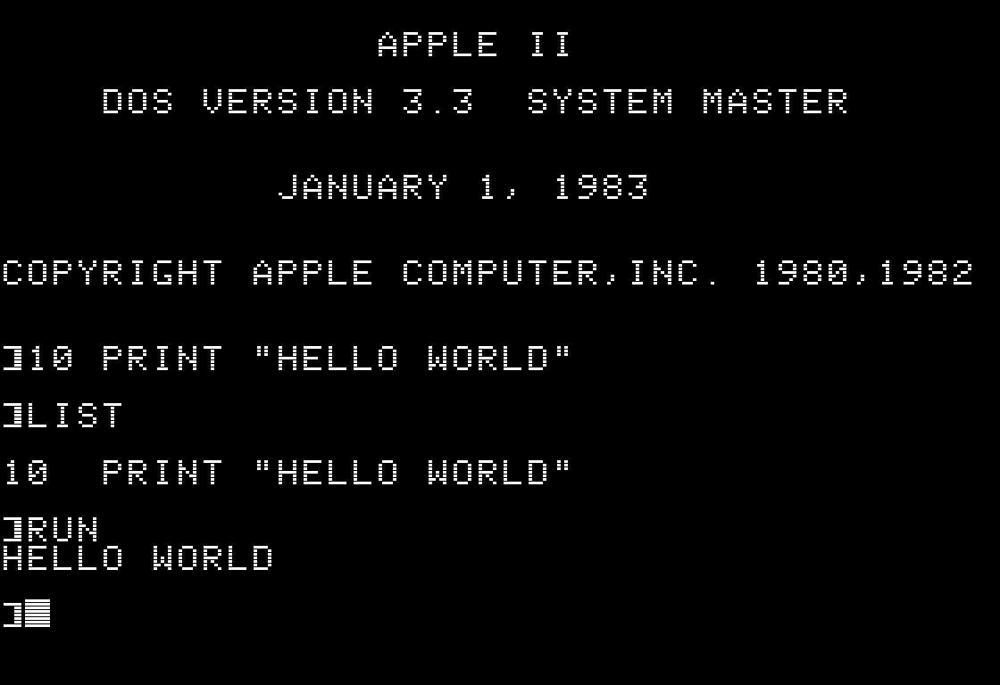
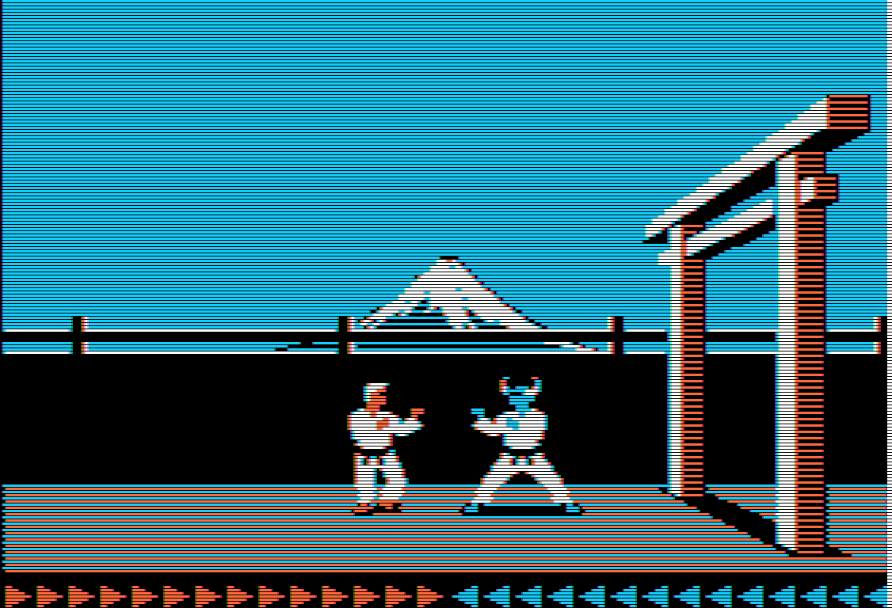
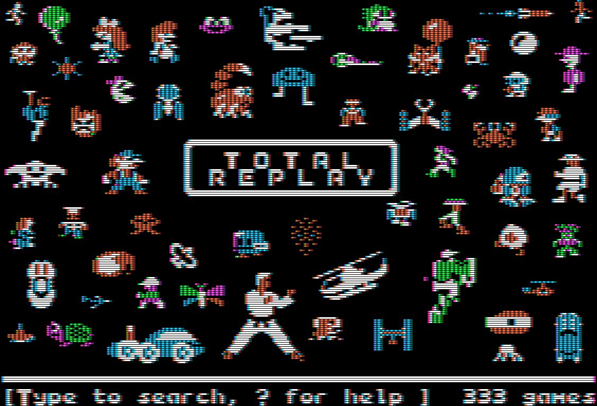

# izapple2 - Apple ][+, //e emulator

Portable emulator of an Apple II+ or //e. Written in Go.

## Features

- Models:
  - Apple ][+ with 48Kb of base RAM
  - Apple //e with 128Kb of RAM
  - Apple //e enhanced with 128Kb of RAM
  - Base64A clone with 48Kb of base RAM and paged ROM
  - Basis 108 clone (partial)
- Storage
  - 16 Sector 5 1/4 diskettes. Uncompressed or compressed witth gzip or zip. Supported formats:
    - NIB (read only)
    - DSK
    - PO
    - [WOZ 1.0 or 2.0](storage/WozSupportStatus.md) (read only)
  - 13 Sector 5 1/4 diskettes. Uncompressed or compressed witth gzip or zip. Supported formats:
    - NIB (read only)
    - [WOZ 2.0](storage/WozSupportStatus.md) (read only)
  - 3.5 disks in PO or 2MG format
  - Hard disk in HDV or 2MG format with ProDOS and SmartPort support
- Emulated extension cards:
  - DiskII controller (state machine based for WOZ files)
  - 16Kb Language Card
  - 256Kb Saturn RAM
  - Parallel Printer Interface card
  - 1Mb Memory Expansion Card (slinky)
  - RAMWorks style expansion Card (up to 16MB additional) (Apple //e only)
  - ThunderClock Plus real time clock
  - Apple //e 80 columns card with 64Kb extra RAM and optional RGB modes
  - No Slot Clock based on the DS1216
  - Videx Videoterm 80 column card with the Videx Soft Video Switch (Apple ][+ only)
  - SwyftCard (Apple //e only)
  - Brain Board
  - Brain Board II
  - MultiROM card
  - Dan ][ Controller card
  - ProDOS ROM card
- Useful cards not emulating a real card
  - Bootable SmartPort / ProDOS card with the following smartport devices:
      - Block device (hard disks)
      - Fujinet network device (supports only http(s) with GET and JSON)
      - Fujinet clock (not in Fujinet upstream)
  - VidHd, limited to the ROM signature and SHR as used by Total Replay, only for //e models with 128Kb
  - FASTChip, limited to what Total Replay needs to set and clear fast mode
  - Mouse Card, emulates the entry points, not the softswitches.
  - Host console card. Maps the host STDIN and STDOUT to PR# and IN#
  - ROMXe, limited to font switching

- Graphic modes:
  - Text 40 columns
  - Text 80 columns (Apple //e and Videx VideoTerm)
  - Low-Resolution graphics
  - Double-Width Low-Resolution graphics (Apple //e only)
  - High-Resolution graphics
  - Double-Width High-Resolution graphics (Apple //e only)
  - Super High Resolution (VidHD only)
  - Mixed mode
  - RGB card text 40 columns with 16 colors for foreground and background (mixable)
  - RGB card mode 11, mono 560x192
  - RGB card mode 12, ntsc 160*192
  - RGB card mode 13, ntsc 140*192 (regular DHGR)
  - RGB card mode 14, mix of modes 11 and 13 on the fly
- Displays:
  - Green monochrome monitor with half width pixel support
  - NTSC Color TV (extracting the phase from the mono signal)
  - RGB for Super High Resolution and RGB card
  - ANSI Console, avoiding the SDL2 dependency
  - Debug mode: shows four panels with actual screen, page1, page2 and extra info dependant of the video mode
- Tracing capabilities:
  - CPU execution disassembled
  - Softswitch reads and writes
  - ProDOS MLI calls
  - Apple Pascal BIOS calls
  - SmartPort commands
  - BBC MOS calls when using [Applecorn](https://github.com/bobbimanners/)
- Other features:
  - Sound
  - Joystick support. Up to two joysticks or four paddles
  - Mouse support. No mouse capture needed
  - Adjustable speed
  - Fast disk mode to set max speed while using the disks
  - Single file executable with embedded ROMs and DOS 3.3
  - Pause (thanks a2geek)
  - Passes the [A2AUDIT 1.06](https://github.com/zellyn/a2audit) tests as II+, //e, and //e Enhanced.
  - Partial pass ot the [ProcessorTests](https://github.com/TomHarte/ProcessorTests) for 6502 and 65c02. Failing test 6502/v1/20_55_13; flags N anv V issues with ADC; and missing some undocumented 6502 opcodes.

By default the following configuration is launched:

- Enhanced Apple //e with 65c02 processor
- RAMWorks card with 80 column, RGB (with Video7 modes) and 8Gb RAM in aux slot
- Parallel print inteface in slot 1
- VidHD card (SHR support) in slot 2
- FASTChip Accelerator card in slot 3
- Mouse card in slot 4
- SmartPort card with 1 device in slot 5 (if an image is provided with -disk35)
- DiskII controller card in slot 6
- SmartPort card with 1 device in slot 7 (if an image is provided with -hd)

## Running the emulator

No installation required. [Download](https://github.com/ivanizag/izapple2/releases) the single file executable `izapple2xxx_xxx` for linux or Mac, SDL2 graphics or console. Build from source to get the latest features.

### Default mode

Execute without parameters to have an emulated Apple //e Enhanced with 128kb booting DOS 3.3 ready to run Applesoft:

``` terminal
casa@servidor:~$ ./izapple2sdl
```



### Play games

Download a DSK or WOZ file or use an URL ([Asimov](https://www.apple.asimov.net/images/) is an excellent source):

``` terminal
casa@servidor:~$ ./izapple2sdl "https://www.apple.asimov.net/images/games/action/karateka/karateka (includes intro).dsk"
```



### Play the Total Replay collection

Download the excellent [Total Replay](https://archive.org/details/TotalReplay) compilation by
[a2-4am](https://github.com/a2-4am/4cade):

``` terminal
casa@servidor:~$ ./izapple2sdl Total\ Replay\ v4.0.hdv
```

Displays super hi-res box art as seen with the VidHD card.



### Terminal mode

To run text mode right on the terminal without the SDL2 dependency, use `izapple2console`. It runs on the console using ANSI escape codes. Input is sent to the emulated Apple II one line at a time:

``` terminal
casa@servidor:~$ ./izapple2console -model 2plus

############################################
#                                          #
#                APPLE II                  #
#                                          #
#     DOS VERSION 3.3  SYSTEM MASTER       #
#                                          #
#                                          #
#            JANUARY 1, 1983               #
#                                          #
#                                          #
# COPYRIGHT APPLE COMPUTER,INC. 1980,1982  #
#                                          #
#                                          #
# ]10 PRINT "HELLO WORLD"                  #
#                                          #
# ]LIST                                    #
#                                          #
# 10  PRINT "HELLO WORLD"                  #
#                                          #
# ]RUN                                     #
# HELLO WORLD                              #
#                                          #
# ]_                                       #
#                                          #
#                                          #
############################################
Line:

```

### Command line options

<!-- doc/usage.txt start -->
```terminal
Usage:  izapple2 [file]
  file
    	path to image to use on the boot device
  -charrom string
    	rom file for the character generator (default "<internal>/Apple IIe Video Enhanced.bin")
  -cpu string
    	cpu type, can be '6502' or '65c02' (default "65c02")
  -forceCaps
    	force all letters to be uppercased (no need for caps lock!)
  -model string
    	set base model (default "2enh")
  -mods string
    	comma separated list of mods applied to the board, available mods are 'shift', 'four-colors
  -nsc string
    	add a DS1216 No-Slot-Clock on the main ROM (use 'main') or a slot ROM (default "main")
  -profile
    	generate profile trace to analyse with pprof
  -ramworks string
    	memory to use with RAMWorks card, max is 16384 (default "8192")
  -rgb
    	emulate the RGB modes of the 80col RGB card for DHGR
  -rom string
    	main rom file (default "<internal>/Apple2e_Enhanced.rom")
  -romx
    	emulate a RomX
  -s0 string
    	slot 0 configuration. (default "language")
  -s1 string
    	slot 1 configuration. (default "empty")
  -s2 string
    	slot 2 configuration. (default "vidhd")
  -s3 string
    	slot 3 configuration. (default "fastchip")
  -s4 string
    	slot 4 configuration. (default "empty")
  -s5 string
    	slot 5 configuration. (default "empty")
  -s6 string
    	slot 6 configuration. (default "diskii,disk1=<internal>/dos33.dsk")
  -s7 string
    	slot 7 configuration. (default "empty")
  -speed string
    	cpu speed in Mhz, can be 'ntsc', 'pal', 'full' or a decimal nunmber (default "ntsc")
  -trace string
    	trace CPU execution with one or more comma separated tracers (default "none")

The available pre-configured models are:
  2: Apple ][
  2e: Apple IIe
  2enh: Apple //e
  2plus: Apple ][+
  base64a: Base 64A
  basis108: Basis 108
  dos32: Apple ][ with 13 sectors disk adapter and DOS 3.2x
  swyft: swyft

The available cards are:
  brainboard: Firmware card. It has two ROM banks
  brainboard2: Firmware card. It has up to four ROM banks
  dan2sd: Apple II Peripheral Card that Interfaces to a ATMEGA328P for SD card storage
  diskii: Disk II interface card
  diskiiseq: Disk II interface card emulating the Woz state machine
  fastchip: Accelerator card for Apple IIe (limited support)
  fujinet: SmartPort interface card hosting the Fujinet
  inout: Card to test I/O
  language: Language card with 16 extra KB for the Apple ][ and ][+
  memexp: Memory expansion card
  mouse: Mouse card implementation, does not emulate a real card, only the firmware behaviour
  multirom: Multiple Image ROM card
  parallel: Card to dump to a file what would be printed to a parallel printer
  prodosromcard3: A bootable 4 MB ROM card by Ralle Palaveev
  prodosromdrive: A bootable 1 MB solid state disk by Terence Boldt
  saturn: RAM card with 128Kb, it's like 8 language cards
  smartport: SmartPort interface card
  softswitchlogger: Card to log softswitch accesses
  swyftcard: Card with the ROM needed to run the Swyftcard word processing system
  thunderclock: Clock card
  videx: Videx compatible 80 columns card
  vidhd: Firmware signature of the VidHD card to trick Total Replay to use the SHR mode

The available tracers are:
  cpm65: Trace CPM65 BDOS calls
  cpu: Trace CPU execution
  mli: Trace ProDOS MLI calls
  mos: Trace MOS calls with Applecorn skipping terminal IO
  mosfull: Trace MOS calls with Applecorn
  panicss: Panic on unimplemented softswitches
  ss: Trace sotfswiches calls
  ssreg: Trace sotfswiches registrations
  ucsd: Trace UCSD system calls

```
<!-- doc/usage.txt end -->

## Building from source

### Linux

Besides having a working Go installation, install the SDL2 developer files. Run:

``` terminal
git clone github.com/ivanizag/izapple2
cd izapple2/frontend/a2sdl
go build .
```

### MacOS

With a working Go installation, run:

``` terminal
brew install SDL2
git clone github.com/ivanizag/izapple2
cd izapple2/frontend/a2sdl
go build .
```

### Windows 

On Windows, CGO needs a gcc compiler. Install [mingw-w64](http://mingw-w64.org/doku.php/download/mingw-builds) and the [SDL2 developer files](https://www.libsdl.org/release/) for mingw-64.

Run:

``` terminal
git clone github.com/ivanizag/izapple2
cd izapple2\frontend\a2sdl
go build .
```

To run in Windows, copy the file `SDL2.dll` on the same folder as `a2sdl.exe`. The latest `SDL2.dll` can be found in the [Runtime binary for Windows 64-bit](https://www.libsdl.org/download-2.0.php).

### Use docker to cross compile for Linux and Windows

To create executables for Linux and Windows without installing Go, SDL2 or the Windows cross compilation toosl, run:

``` terminal
cd docker
./build.sh
```
