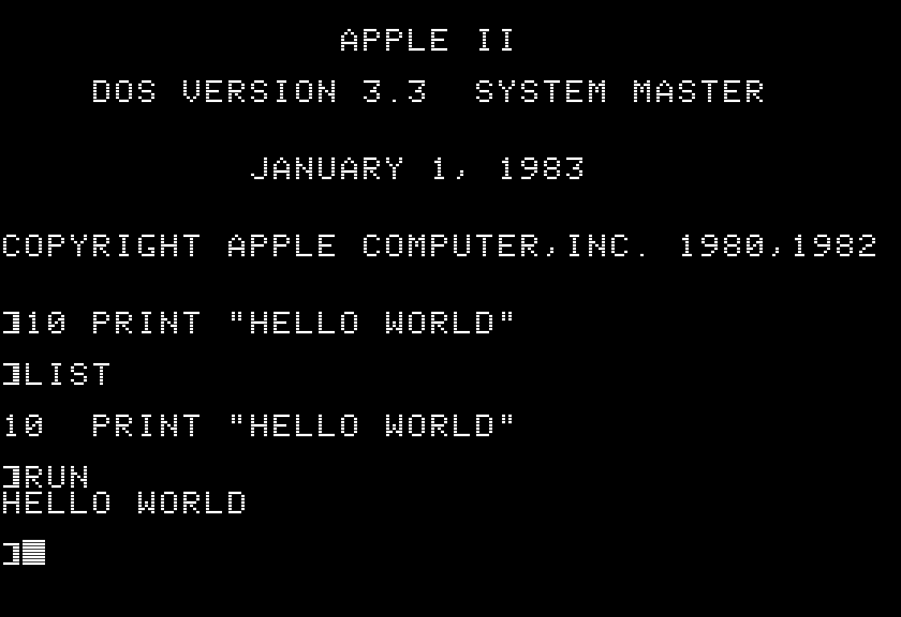
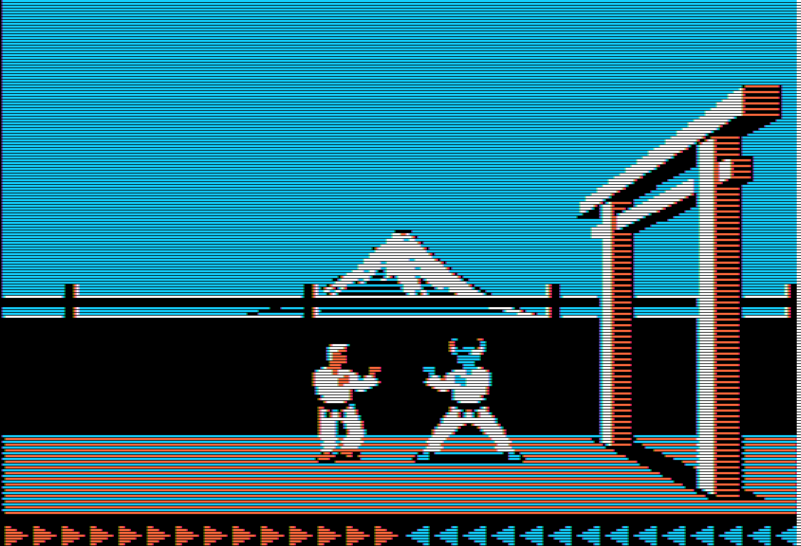
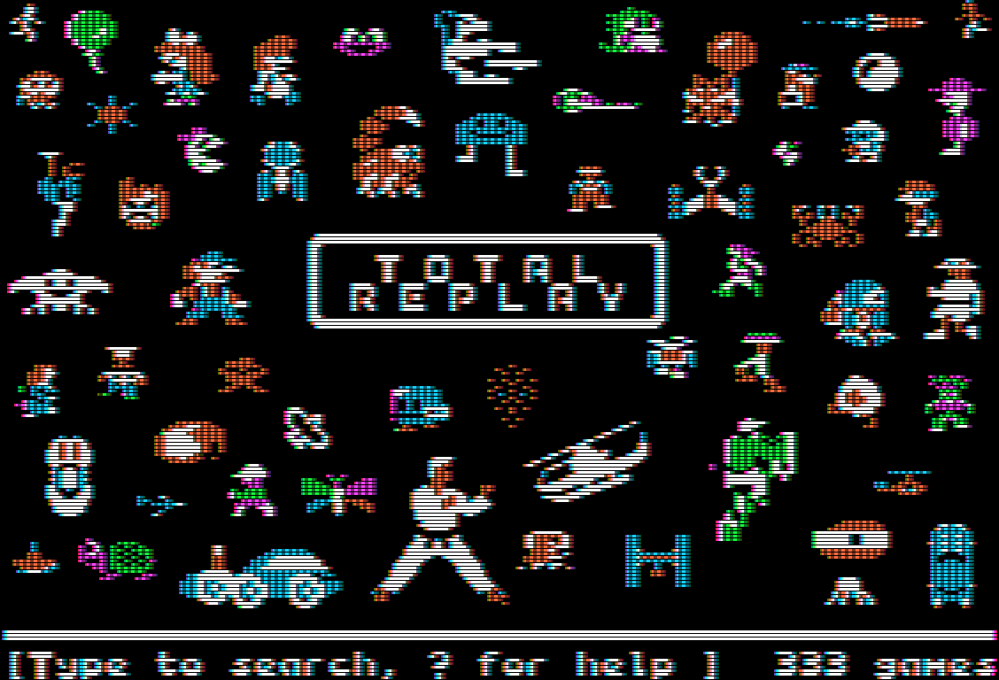

# izapple2 - Apple ][+, //e emulator

Portable emulator of an Apple II+ or //e. Written in Go.

## Features

izapple2 emulates the Apple ][+ and the Apple //e, enhanced or not, and the Base64A and Basis 108 clones.
See [doc/features.md](doc/features.md) for the complete list of features and supported cards and graphic modes.

## Installation

No installation required. [Download](https://github.com/ivanizag/izapple2/releases) the single file executable `izapple2` for Linux, Windows or Mac. It is the SDL2 frontend, see [Frontends](#frontends) for the others. Build from source to get the latest features.

Optionally, it can be installed with homebrew using:

``` terminal
brew install ivanizag/tap/izapple2
```

## Default mode

Execute without parameters to have an emulated Apple //e Enhanced with 128kb booting DOS 3.3 ready to run Applesoft. The cards it comes with are in [the default configuration](doc/features.md#the-default-configuration):

``` terminal
casa@servidor:~$ ./izapple2
```



## Play games

Download a DSK or WOZ file or use an URL ([Asimov](https://www.apple.asimov.net/images/) is an excellent source):

``` terminal
casa@servidor:~$ ./izapple2 "https://www.apple.asimov.net/images/games/action/karateka/karateka (includes intro).dsk"
```



## Play the Total Replay collection

Download the excellent [Total Replay](https://archive.org/details/TotalReplay) compilation by
[a2-4am](https://github.com/a2-4am/4cade):

``` terminal
casa@servidor:~$ ./izapple2 Total\ Replay\ v6.0.1.hdv
```

Displays super hi-res box art as seen with the VidHD card.



## Command line options

See [doc/command_line.md](doc/command_line.md) for a complete guide on command line configuration.

## Frontends

The emulator itself is a Go library. What you run is one of the frontends in the `frontend` directory: they all build the same machine, take the same [command line options](doc/command_line.md) and load the same disks, but they differ in what they can show and in how you talk to them.

Each one has a page with how to build it, how to use it and what it can not do:

- [**a2sdl**](doc/frontend_sdl2.md): a window with SDL2. The complete one, and the one in the [releases](https://github.com/ivanizag/izapple2/releases) and in the Homebrew formula. Use this one unless you have a reason not to.
- [**a2sdl3**](doc/frontend_sdl3.md): the same, on SDL3. It needs neither cgo, nor a C compiler, nor SDL developer files, and it cross compiles to every platform from any of them. Experimental, not in the releases.
- [**console**](doc/frontend_console.md): text mode right on the terminal with ANSI escape codes, without the SDL2 dependency. Input goes in a line at a time.
- [**a2libretro**](doc/frontend_libretro.md): a libretro core, to run inside RetroArch, Lakka, Batocera, RetroPie and the rest. On a Mac, [doc/frontend_libretro_macos.md](doc/frontend_libretro_macos.md) walks through the whole thing from installing RetroArch.
- [**a2ebiten**](doc/frontend_ebiten.md): a window with [Ebitengine](https://ebitengine.org/). The same keys as a2sdl, no disks to drop and no joysticks. It is the desktop half of the WebAssembly frontend.
- [**a2wasm**](doc/frontend_wasm.md): the emulator in the browser, compiled to WebAssembly with a React interface around it.
- [**a2fyne**](doc/frontend_fyne.md): a window with [Fyne](https://fyne.io/), a toolbar and a panel listing the cards in the slots. No sound. Unfinished.
- [**headless**](doc/frontend_headless.md): no window and no screen, a command prompt to drive the machine and take snapshots. For scripting and for tests.

Additionally there is a derived project, [izapplebasic](https://github.com/ivanizag/izapplebasic), that adds a couple of frontends to a simplified Apple ][+ emulator with no cards and tape drive:

- CLI: with getline like support and command history.
- Telegram: Interactive use. Currently running at <https://t.me/a2basic_bot>

## Building from source

Every frontend is a Go main package in its own directory. With a working Go installation, the build is always:

``` terminal
git clone github.com/ivanizag/izapple2
cd izapple2/frontend/a2sdl
go build .
```

That builds `a2sdl`, the SDL2 frontend, which needs a C compiler and the SDL2 developer files: `libsdl2-dev` on Linux, `brew install SDL2` on MacOS, [mingw-w64](http://mingw-w64.org/doku.php/download/mingw-builds) and the [SDL2 developer files](https://www.libsdl.org/release/) on Windows. See [doc/frontend_sdl2.md](doc/frontend_sdl2.md) for the details.

The other frontends replace `a2sdl` with their own directory and need other things, or nothing at all. Each page in [Frontends](#frontends) has its own instructions.

